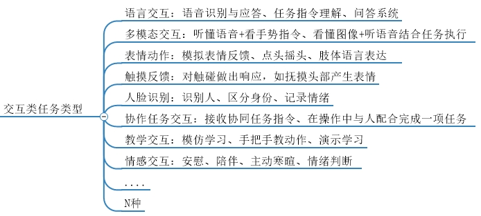

# 交互类机器人数据集介绍

交互类机器人数据集专注于记录机器人在与人类进行各种交互任务时的多模态动态数据。这些数据集涵盖了语言交互、多模态交互、表情动作、触摸反馈、人脸识别、协作任务交互、教学交互和情感交互等多种类型，为机器人的交互能力提升提供了丰富的数据支持。

## 数据集特点
- **多交互类型**：涵盖语言交互（语音识别与应答、任务指令理解、问答系统）、多模态交互（语音+手势、图像+语音）、表情动作（模拟表情、肢体语言）、触摸反馈（触碰响应）、人脸识别（身份识别、情绪记录）、协作任务交互（协同任务指令、配合完成任务）、教学交互（模仿学习、手把手教学）、情感交互（安慰、陪伴、情绪判断）等多种类型。
- **多模态数据**：融合语音、图像、深度信息、力觉反馈、关节角度等多模态数据，提供丰富的感知信息。
- **高数据质量**：数据具备高时序精度和结构一致性，确保数据的可靠性和可用性。
- **广泛适用性**：适用于自然语言处理、多模态交互、情感计算、机器人协作等关键技术方向。

## 数据集应用
- **语言交互**：通过语音识别和自然语言处理技术，实现机器人与人类的流畅对话，理解任务指令并进行问答。
- **多模态交互**：结合语音和视觉信息，使机器人能够理解和执行更复杂的指令，如手势指令和图像识别结合的任务。
- **表情动作**：通过模拟表情和肢体语言，使机器人能够更自然地与人类互动，增强交互的自然性和友好性。
- **触摸反馈**：使机器人能够对触碰做出响应，如抚摸头部产生表情，增强人机交互的亲和力。
- **人脸识别**：通过人脸识别技术，机器人能够识别人的身份、区分不同用户，并记录情绪状态。
- **协作任务交互**：使机器人能够接收协同任务指令，并在操作中与人类配合完成任务。
- **教学交互**：通过模仿学习和手把手教学，机器人能够学习新技能并进行演示。
- **情感交互**：使机器人能够进行安慰、陪伴、主动寒暄，并判断用户的情绪状态。

## 数据集优势
- **现实性**：数据集中的数据均来自真实环境中的机器人交互，具有高度的现实性和实用性。
- **通用性**：数据格式和结构设计通用，易于与其他算法和系统集成，支持多种研究和应用。
- **丰富性**：涵盖多种交互类型和任务场景，提供丰富的数据样本，满足不同研究需求。

交互类机器人数据集为具身智能的研究和应用提供了坚实的数据基础，助力机器人在复杂环境中的高效交互和智能决策。

## 操作类数据集思维导图

### 🔗 数据下载链接索引
| 数据集名称     | 链接                                                        |
| :-------- | :-------------------------------------------------------- |
| 消防栓漏水数据集 | [链接](https://pan.baidu.com/s/1dPGkzL7FhKZhst__9X4qag?pwd=iRIC) |
| 烟火数据集 | [链接](https://pan.baidu.com/s/1cWoEm08tAnzYArBbtXc22Q?pwd=iRIC) |
| 地面积水数据集 | [链接](https://pan.baidu.com/s/1UQHzK_25iuXOt160EBnMzw?pwd=iRIC) |