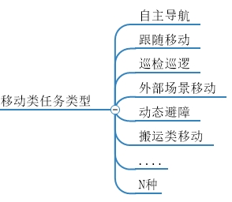

# 移动类型机器人数据集介绍

移动类型机器人数据集专注于记录各种移动机器人（如轮式机器人、四足机器人、无人机等）在不同环境中的操作行为和环境响应。这些数据集为机器人的导航、避障、路径规划等任务提供了丰富的多模态数据支持。

## 数据集特点
- **多机器人类型**：涵盖8轮机器人、4轮机器人、2轮机器人、四足狗、管道机器人、扫地机器人、爬臂机器人、水下机器人、人形机器人、无人机、医疗机器人和灵巧手等多种类型。
- **多任务场景**：包含工业场景、家庭场景、医疗场景和户外场景等多种实际应用环境。
- **多模态数据**：融合视觉图像、深度信息、关节角度、运动轨迹和力觉反馈等多模态数据，提供丰富的感知信息。
- **高数据质量**：数据具备高时序精度和结构一致性，确保数据的可靠性和可用性。
- **广泛适用性**：适用于运动建模、模仿学习、强化学习、动态路径规划、视觉伺服控制、力-位混合控制等关键技术方向。

## 数据集应用
- **运动建模**：通过分析关节角度和运动轨迹数据，建立机器人的运动模型，优化路径规划和运动控制。
- **模仿学习**：利用视觉图像和力觉反馈数据，让机器人学习人类操作者的动作模式，快速掌握新任务。
- **强化学习**：结合多模态数据，设计奖励函数，训练机器人在复杂环境中自主决策，提高任务成功率。
- **动态路径规划**：基于视觉和深度信息，实时感知环境变化，动态调整路径，实现高效避障和导航。
- **视觉伺服控制**：利用视觉图像反馈，实时调整机器人的动作，提高操作精度和灵活性。
- **力-位混合控制**：结合力觉反馈和位置信息，实现精确的力控制和位置控制，适用于需要精细操作的任务。

## 数据集优势
- **现实性**：数据集中的数据均来自真实环境中的机器人操作，具有高度的现实性和实用性。
- **通用性**：数据格式和结构设计通用，易于与其他算法和系统集成，支持多种研究和应用。
- **丰富性**：涵盖多种机器人类型和任务场景，提供丰富的数据样本，满足不同研究需求。

移动类型机器人数据集为具身智能的研究和应用提供了坚实的数据基础，助力机器人在复杂环境中的高效操作和智能决策。

## 操作类数据集思维导图

### 🔗 数据下载链接索引
#### [数据下载](https://pan.baidu.com/s/1ras_lpsMnP-SR42a72iSIg?pwd=iRIC)
